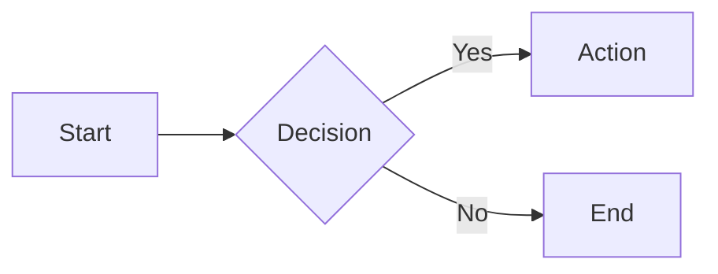
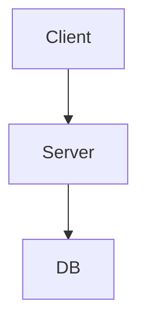

# LearnMD — Format Specification v0.2

## Core principle: Markdown first

LearnMD is the **companion format to QuizMD**: where QuizMD covers assessment (testing what you know), LearnMD covers instruction (explaining what to know). Together they form a complete **teach → assess** stack, all in portable plain-text files.

**A complete learning path — chapters, lessons, exercises, quizzes — can live in a single valid `.learn.md` file.** The `!import` directive is an optimization tool for reusability, not a prerequisite.

| Principle | Description |
|-----------|-------------|
| **Markdown-first** | A `.learn.md` file is valid Markdown — readable in any editor |
| **Git-native** | Versionable, diffable, and mergeable like code |
| **AI-native** | Generatable and consumable by LLMs without special tooling |
| **Progressively enriched** | Plain text (Level 0) up through special fenced blocks (Level 2) |
| **QuizMD-interoperable** | Inline ` ```quiz ` blocks and `!import` directive to embed checkpoints |

---

## Format levels

| Level | Mechanism | Purpose |
|-------|-----------|---------|
| 0 | Plain `.learn.md`, pure Markdown | Minimal learning content, human-readable |
| 1 | YAML frontmatter + GFM callouts | Metadata, estimated time, language |
| 2 | Special fenced blocks + directives | Examples, summaries, inline quizzes, imports |

Each level is a strict superset of the previous one. A Level 0 file is valid at Level 1 and 2.

---

## Document architecture

### Three-tier hierarchy

```
path (.learn.md, minimal or no frontmatter)
└── module (## heading)
    └── lesson (### heading or file imported via !import)
```

- Structure is **strictly linear** in v0.2 (no branching)
- ` ```quiz ` blocks and `!import` directives are usable at any level
- External content is referenced via native Markdown links `[text](url)` and ``

---

## Level 0 — Plain Markdown

### Conventions

| Syntax | Meaning |
|--------|---------|
| `# Title` | Document title (inferred by the parser if absent from frontmatter) |
| `## Module title` | Main section heading |
| `### Lesson title` | Sub-section heading |
| `> text` | Generic blockquote or note |
| `!import ./file.learn.md` | Include another lesson file |
| `!import ./file.quiz.md` | Embed a QuizMD checkpoint from an external file |
| `$...$` | Inline LaTeX math formula |
| `$$...$$` | Block (display) LaTeX math formula |

### Minimal example

```markdown
# Introduction to Python

## Module 1 — Variables

A variable is a named reference to a value in memory.

```python
age = 25
```

## Module 2 — Conditions

An `if` statement runs code only when a condition is true.

```python
if age >= 18:
    print("Adult")
```
```

---

## Level 1 — YAML frontmatter

A YAML block at the top of the `.learn.md` file, between two `---` lines.

```yaml
---
title: Python Variables       # optional — inferred from the first # H1 if absent
lang: en                      # REQUIRED — BCP-47 code (en, fr, en-US, …)
estimated_time: 15min         # optional — free-form duration string
tags: [python, variables]     # optional — list of strings
author: Jane Smith            # optional — string or {name, email, url}
---
```

### Frontmatter field reference

| Field | Required | Type | Description |
|-------|----------|------|-------------|
| `title` | No | string | Overrides the first `# H1`. Inferred from H1 if absent. |
| `lang` | **Yes** | BCP-47 | Language code: `en`, `fr`, `en-US`, etc. |
| `estimated_time` | No | string | Free-form estimated reading/study time: `15min`, `1h30`, `2h` |
| `tags` | No | string[] | Thematic tags |
| `author` | No | string or object | Author name, or `{name, email, url}` |
| `spec_version` | No | string | LearnMD spec version this file targets (e.g. `"0.2"`) |

`lang` is the only required field. All other fields are optional.

### GFM callouts

Callouts use GitHub Flavored Markdown syntax and are rendered with visual emphasis by compatible players.

**Supported everywhere** (GitHub, Obsidian, neuroneo.md):

| Syntax | Semantic | Typical use |
|--------|----------|-------------|
| `> [!note]` | Note | Supplementary information |
| `> [!tip]` | Tip | Best practice, shortcut, helpful advice |
| `> [!warning]` | Warning | Common pitfall, frequent mistake |
| `> [!important]` | Important | Critical point to remember |
| `> [!caution]` | Caution | Risk of error or data loss |

**Supported on Obsidian and neuroneo.md** (degrade gracefully to a blockquote on GitHub):

| Syntax | Semantic | Typical use |
|--------|----------|-------------|
| `> [!summary]` | Summary | Key takeaways at the end of a lesson |
| `> [!example]` | Example | Non-code illustrative example |
| `> [!objectives]` | Learning Objectives | What the learner will be able to do after this lesson — place at the top |

```markdown
> [!warning]
> In Python, variable names are case-sensitive:
> `Age` and `age` are two different variables.
```

```markdown
> [!tip]
> Use descriptive names: `student_count` is clearer than `n`.
```

```markdown
> [!summary]
> - Variables associate a name with a value
> - Python infers types dynamically
> - Names are case-sensitive: `Age` ≠ `age`
```

```markdown
> [!example] Tokenising a sentence
> Input: "Hello world!"
> Tokens: ["Hello", " world", "!"]  → 3 tokens
```

---

## Level 2 — Special fenced blocks and directives

Special blocks follow the same fenced syntax as QuizMD (` ```type `). They add structured, semantically meaningful containers to the lesson content.

### ` ```quiz ` — Inline checkpoint

Embeds a **single question** using QuizMD syntax directly in the lesson. All QuizMD question types are supported: `mcq`, `multi`, `open`, `tf`, `match`, `order`.

**Syntax:**

`````markdown
```quiz
? What operator assigns a value in Python?
- [x] =
- [ ] ==
- [ ] :=
```
`````

The question starts with `?` followed by the question text. Answer choices use `- [x]` (correct) and `- [ ]` (incorrect), identical to QuizMD Level 0.

**Attributes** (appended after the word `quiz` on the opening line):

| Attribute | Default | Description |
|-----------|---------|-------------|
| `scored:false` | Yes (default) | Practice mode — immediate feedback, no score recorded |
| `scored:true` | — | Scored checkpoint — contributes to lesson score |

```markdown
```quiz scored:true
? What is the type of `42` in Python?
- [x] int
- [ ] float
- [ ] str
```
```

**Inline quiz vs external file:**

| Need | Syntax |
|------|--------|
| Single simple question | Inline ` ```quiz ` block |
| Multiple questions, advanced scoring, or shared config | `!import ./file.quiz.md` directive |

### Fenced callout blocks

Fenced callout blocks are **Level 2 alternatives to GFM callouts** (`> [!...]`). They support richer content (multi-paragraph, nested lists, syntax-highlighted code) and are rendered with a visual header by compatible players. Non-compatible renderers display the raw content as a plain code block.

**Supported block types:**

| Language | Icon | Label | Typical use |
|----------|------|-------|-------------|
| ` ```note ` | 📝 | Note | Supplementary information |
| ` ```tip ` | 💡 | Tip | Best practice or helpful advice |
| ` ```warning ` | ⚠️ | Warning | Common pitfall, frequent mistake |
| ` ```important ` | ❗ | Important | Critical point to remember |
| ` ```caution ` | 🔴 | Caution | Risk of error or data loss |
| ` ```summary ` | ✅ | Summary | Key takeaways at the end of a lesson |
| ` ```example ` | 🔍 | Example | Illustrative example |
| ` ```objectives ` | 🎯 | Learning Objectives | What the learner will achieve — place at top |

**Basic syntax:**

`````markdown
```summary
- Variables associate a **name** with a **value**
- Python infers types dynamically — no declaration needed
- Names are case-sensitive: `Age` ≠ `age`
```
`````

**Optional title attribute** (`title:"..."`):

`````markdown
```example title:"Token prediction"
Context: "The capital of France is"
Most likely token: " Paris"
Less likely token: " Lyon"
```
`````

**Optional code language** — place the language identifier before `title:` to render the body as a syntax-highlighted code block:

`````markdown
```example python title:"Assigning and reassigning a variable"
score = 0
print(score)   # → 0

score = 42
print(score)   # → 42
```
`````

When a code language is present, the block body is rendered as a syntax-highlighted code block inside the callout. When absent, the body is rendered as Markdown prose.

**Fenced vs GFM callouts:**

| Feature | GFM callout (`> [!...]`) | Fenced callout (` ```type `) |
|---------|--------------------------|-------------------------------|
| GitHub rendering | ✅ Native | ⚠️ Degrades to code block |
| Multi-paragraph content | Limited | ✅ Full Markdown |
| Syntax-highlighted code body | ❌ | ✅ via `lang` token |
| Optional title | Limited | ✅ via `title:"..."` |
| neuroneo.md rendering | ✅ | ✅ |

### Composition directives

#### `!import <path>`

Includes content from another file at the current position. The file type is detected from the extension:

- **`.learn.md`** — lesson content is inserted inline (frontmatter ignored)
- **`.quiz.md`** — renders as an interactive QuizMD checkpoint

```markdown
!import ./03-conditions.learn.md
!import ./check-variables.quiz.md
```

Behavior:
- The imported file's content is inserted at the position of the directive.
- For `.learn.md`: the file's content is **rendered inline** at the insertion point — the section title appears as a visual divider and in the table of contents. Frontmatter (metadata) is ignored.
- Imports are recursive: an imported file may itself contain `!import` directives.
- Circular imports are silently skipped.

---

## Math support

LearnMD uses the same math syntax as QuizMD. LaTeX formulas are rendered via KaTeX and are **auto-detected**: no frontmatter flag is required.

| Form | Syntax | Rendering |
|------|--------|-----------|
| Inline | `$E = mc^2$` | Embedded in the line of text |
| Block (display) | `$$\int_0^\infty e^{-x}\,dx = 1$$` | Centered on its own line |

Math may appear in any part of the document: body text, callouts, and inline quiz questions.

```markdown
The derivative is defined as:

$$f'(x) = \lim_{h \to 0} \frac{f(x+h) - f(x)}{h}$$

Applying this to $f(x) = x^2$, we get $f'(x) = 2x$.
```

The supported subset is **KaTeX** (see [katex.org/docs/support_table](https://katex.org/docs/support_table.html)).

---

## ABC music notation

LearnMD supports **ABC notation** for embedding sheet music inline in lesson content. Compatible renderers (e.g. neuroneo.md) use [abcjs](https://www.abcjs.net/) to produce SVG output directly in the browser — no server required.

### Syntax

Use a fenced code block with the language identifier `abc`, optionally followed by space-separated flags:

```
```abc [play] [cursor] [colors]
```

| Flag | Description |
|------|-------------|
| *(none)* | Static SVG score only |
| `play` | Adds audio controls (play, restart, progress bar) |
| `cursor` | Highlights the current note during playback (requires `play`) |
| `colors` | Colors each note by pitch class on the chromatic wheel (requires `play`) |

Flags are combinable in any order: ` ```abc play cursor colors `

````markdown
```abc
X:1
T:Scale of C major — static
M:4/4
L:1/4
K:C
CDEF|GABC|
```

```abc play
X:1
T:Scale of C major — with audio
M:4/4
L:1/4
K:C
CDEF|GABC|
```

```abc play cursor colors
X:1
T:Scale of C major — fully interactive
M:4/4
L:1/4
K:C
CDEF|GABC|
```
````

### Rendering

- Compatible renderers replace the `abc` block with an inline SVG score.
- Non-compatible renderers (e.g. GitHub) display the raw ABC text as a code block — the format degrades gracefully.
- The `play` flag uses the Web Audio API via [abcjs synth](https://www.abcjs.net/api-synth.html); it is loaded lazily only when ABC blocks are present in the document.
- ABC notation may appear anywhere in lesson prose: body text, callouts, and inside ` ```note ` or ` ```concept ` blocks.

### Example

````markdown
### Lesson 1 — The major scale

The C major scale uses only natural notes:

```abc play cursor
X:1
T:C major scale
M:4/4
L:1/4
K:C
CDEF|GABC|
```

Notice that the intervals follow the pattern: W W H W W W H.
````

---

## Penrose diagrams

LearnMD supports **Penrose** declarative mathematical diagrams, rendered via [@penrose/core](https://penrose.cs.cmu.edu/). Diagrams can appear anywhere in a lesson document.

### Syntax

Use a fenced code block with the `penrose` language identifier. Three sections separated by a line containing exactly `---`:

```
domain program
---
style program
---
substance program
```

| Section | Role |
|---------|------|
| **domain** | Declares types, predicates, and constructors |
| **style** | Maps domain elements to visual shapes and layout |
| **substance** | Describes the specific mathematical objects to draw |

Shorter forms are allowed: 2 sections (style/substance), or 1 section (substance only).

Penrose is **auto-detected**: `@penrose/core` is loaded only when a ` ```penrose ` block is present in the document.

### Example

```penrose
type Set
predicate Subset(Set A, Set B)
---
canvas { width = 300, height = 200 }

Set s {
  shape s.icon = Circle {
    r: 50
    fillColor: rgba(100, 149, 237, 0.3)
    strokeColor: rgba(100, 149, 237, 1)
    strokeWidth: 2
  }
  shape s.label = Text {
    string: s.label
    fontSize: "16px"
  }
  s.label below s.icon
}

Subset(A, B) {
  ensure contains(B.icon, A.icon)
}
---
Set A
Set B
Subset(A, B)
```

### Constraints

- Full language reference: [penrose.cs.cmu.edu](https://penrose.cs.cmu.edu/)
- Text labels require font files and may not appear in all environments.


---

## Mermaid diagrams

LearnMD supports **Mermaid** text-based diagrams via [Mermaid.js](https://mermaid.js.org/). Diagrams can appear anywhere in a lesson document.

> **Note:** Static image embeds (``) are **not supported** for security reasons. Mermaid diagrams are defined as text and rendered client-side.

### Syntax

Use a fenced code block with the `mermaid` language identifier:

````markdown

````

Optional block attributes can follow the language identifier:

````markdown

````

| Attribute | Type | Description |
|-----------|------|-------------|
| `caption` | string | Caption displayed below the diagram |
| `width` | CSS value | Diagram width (e.g. `100%`, `600px`) |

### Supported diagram types

| Type | Keyword | Example use |
|------|---------|-------------|
| Flowchart | `flowchart` / `graph` | Process flows, decision trees |
| Sequence | `sequenceDiagram` | API call flows, interactions |
| Class | `classDiagram` | OOP relationships, data models |
| Entity-Relationship | `erDiagram` | Database schemas |
| Gantt | `gantt` | Project timelines |
| Mindmap | `mindmap` | Topic hierarchies |
| Timeline | `timeline` | Historical sequences |

### AI authoring

Mermaid diagram syntax is text-based and AI-generatable. When using MCP tools or Claude, you can ask for diagrams inline:

> "Add a sequence diagram showing how a JWT token is validated."

Claude will emit a valid `` ```mermaid `` block directly in the `.learn.md` file.

When generating Mermaid diagrams:

- Prefer LR orientation for sequential flows with more than 5 steps
- Keep node labels under 40 characters; use `\n` to break longer labels
- Avoid linear chains longer than 6 nodes; introduce subgraphs or branches
- Limit vertical depth to 7 levels maximum in TD orientation
- Use TD only when the diagram has meaningful hierarchy (not just a sequence)

### Constraints

- Mermaid is **auto-detected**: the Mermaid runtime is loaded only when a `` ```mermaid `` block is present.
- Not all Mermaid diagram types are guaranteed in all player environments — `flowchart`, `sequence`, and `classDiagram` have the widest support.
- Full language reference: [mermaid.js.org](https://mermaid.js.org/)

---

## Syntax reference table

| Element | Syntax | Level |
|---------|--------|-------|
| Document title | `# Title` | 0 |
| Module heading | `## Module title` | 0 |
| Lesson heading | `### Lesson title` | 0 |
| Generic blockquote | `> text` | 0 |
| Import lesson | `!import ./file.learn.md` | 0 |
| Embed quiz checkpoint | `!import ./file.quiz.md` | 0 |
| Inline math | `$formula$` | 0 |
| Block math | `$$formula$$` | 0 |
| Frontmatter | `---` YAML `---` | 1 |
| Note callout | `> [!note]` | 1 |
| Tip callout | `> [!tip]` | 1 |
| Warning callout | `> [!warning]` | 1 |
| Important callout | `> [!important]` | 1 |
| Caution callout | `> [!caution]` | 1 |
| Summary callout | `> [!summary]` | 1 |
| Example callout | `> [!example]` | 1 |
| Objectives callout | `> [!objectives]` | 1 |
| Inline quiz question | ` ```quiz ` | 2 |
| Scored inline quiz | ` ```quiz scored:true ` | 2 |
| Note callout (fenced) | ` ```note ` | 2 |
| Tip callout (fenced) | ` ```tip ` | 2 |
| Warning callout (fenced) | ` ```warning ` | 2 |
| Summary callout (fenced) | ` ```summary ` | 2 |
| Example callout (fenced) | ` ```example [lang] [title:"..."] ` | 2 |
| Objectives callout (fenced) | ` ```objectives ` | 2 |
| Concept block | ` ```concept [id:slug] ` | 2 |
| ABC (static) | ` ```abc ` ABC text ` ``` ` | 0 |
| ABC (interactive) | ` ```abc play cursor colors ` ABC text ` ``` ` | 0 |
| Mermaid diagram | ` ```mermaid ` diagram text ` ``` ` | 0 |
| Mermaid (with caption) | ` ```mermaid caption:"..." width:80% ` | 0 |

---

## Validation

### Lenient mode (default)

| Condition | Level |
|-----------|-------|
| `lang` absent from frontmatter | Warning |
| Title absent (no H1 and no frontmatter `title`) | Warning |
| Unclosed fenced block | Error |
| Inline ` ```quiz ` block with no `?` line | Error |
| `!import` pointing to a `.quiz.md` with no valid questions | Warning |
| `!import` pointing to a missing file | Warning |

### Strict mode (`--strict`)

| Condition | Level |
|-----------|-------|
| `lang` absent | Error |
| Title absent | Error |
| All lenient-mode errors | Error |

Strict mode is recommended for CI pipelines and production publishing. Lenient mode is appropriate during authoring.

---

## Complete example — single-file path

`````markdown
---
title: Introduction to Python
lang: en
estimated_time: 2h
tags: [python, programming, beginner]
---

# Introduction to Python

A guided tour of Python basics, from variables to list manipulation.

## Module 1 — Variables

### Lesson 1 — Declaring a variable

A variable is a named reference to a value in memory.

```python
age = 25
name = "Alice"
```

> [!tip]
> Use descriptive names: `student_count` is clearer than `n`.

> [!warning]
> Variable names are case-sensitive: `Age` and `age` are two different variables.

```quiz
? Which syntax is valid Python?
- [x] age = 25
- [ ] int age = 25
- [ ] var age = 25
```

### Lesson 2 — Basic types

Python infers types automatically — no type declarations needed.

```python
age = 25        # int
pi = 3.14       # float
name = "Alice"  # str
active = True   # bool
```

```python
# Inspecting types
print(type(25))       # <class 'int'>
print(type(3.14))     # <class 'float'>
print(type("hello"))  # <class 'str'>
```

```quiz scored:true
? What is the type of `42` in Python?
- [x] int
- [ ] float
- [ ] str
```

> [!summary]
> - A variable associates a name with a value
> - Python infers types dynamically — no declaration required
> - Use `type()` to inspect the type of any object
> - Names are case-sensitive: `Age` ≠ `age`

## Module 2 — Conditions

!import ./03-conditions.learn.md

!import ./check-conditions.quiz.md
`````

---

## Relationship with QuizMD

LearnMD and QuizMD are complementary formats designed to work together:

| Dimension | LearnMD | QuizMD |
|-----------|---------|--------|
| Primary purpose | Teach | Assess |
| File extension | `.learn.md` | `.quiz.md` |
| Core unit | Section / Module | Question |
| Scoring | Delegated to ` ```quiz ` blocks | Native (points, passing_score) |
| Sequencing | Linear, modules and lessons | Sequential or all-at-once |
| Inline other format | ` ```quiz ` + `!import ./file.quiz.md` | `!import` for sub-quizzes |
| Standalone use | Yes | Yes |

---

## MCP integration

The neuroneo.md MCP server exposes LearnMD to compatible AI assistants.

### Exposed tools

| Tool | Input | Output |
|------|-------|--------|
| `parse_learn` | `content: string` | JSON structure (title, sections, blocks, directives) |
| `validate_learn` | `content: string`, `strict?: bool` | List of errors and warnings |
| `upload_learn` | `content, api_key, title` | Hosted lesson URL on neuroneo.md |

